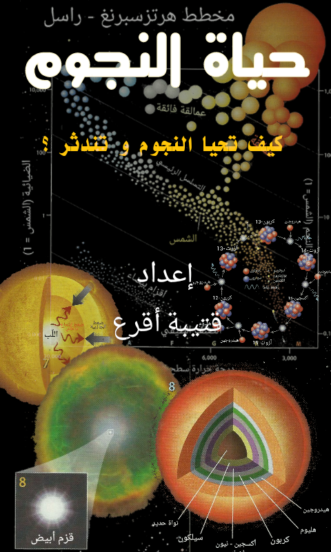

# StarLives
حياة النجوم
يمكن تصفح الموقع على الرابط التالي : https://kutaibaa-akraa.github.io/StarLives/
<H1>حول البرنامج</H1>

إن لنجوم الكون أعماراً محدودة تماماً و هي شديدة الشبه بحياة الإنسان. إذ تبدأ النجوم حياتها فتية مشرقة ذات نشاط داخلي عالٍ تحدث فيها تفاعلات نووية هي المحرك الأساسي لوجودها. و عبر مئات الملايين و ربما مليارات السنين تشيخ و تبرد و تنطفئ . في هذا البرنامج البسيط أردت توثيق الخطوط العامة لمسيرة مختلف أنواع النجوم بلغة  علمية مبسطة و مختصرة و للتأكيد على أن شمسنا ما هي إلا نجم قريب بل من أقرب النجوم إلينا في الكون و لا تختلف مسيرة حياتها عن باقي النجوم التي نراها في سماء الليل!

<h1>حول المؤلف</h1>

اسمي قتيبة أقرع و من مواليد مدينة دمشق و اقطن في مدينة حلب . حائز على شهادة بكالوريوس في الفيزياء و الكيمياء و على دبلوم فيزياء الكترونيات الجسم الصلب. 
يحتاج مني الكتابة صفحات عديدة لتفسير سبب حبي و تعلقي بعلم الفلك !! .
ربما سيكون هذا البرنامج نواة صغيرة لأعمال قادمة متعددة لتبسيط و نشر علم الفلك على الصعيد العربي تحديداً.
شكراً لاستخدامكم هذا البرنامج و ارجو ان ينال إعجابكم
  
قتيبة أقرع
 2 أيلول-سبتمبر 2017

